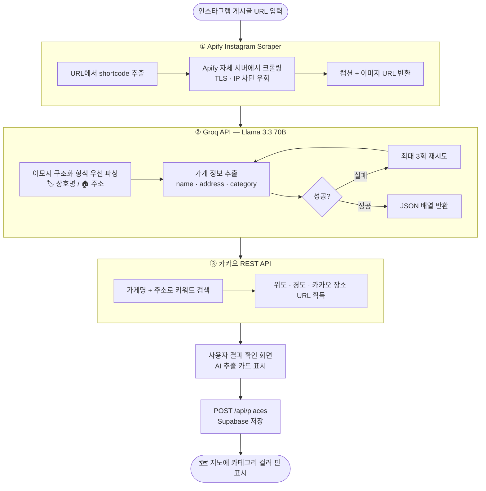

  

  인스타그램에서 발견한 가고싶은 장소를 지도에 바로 저장

  <a href="https://insta-place-saver.vercel.app">🌐 서비스 바로가기</a>

---

## 서비스 소개

인스타그램에서 가보고 싶은 장소를 발견했을 때, 기존에는 두 가지 방법밖에 없었습니다.

| 방법              | 문제점                                                                                                          |
| ----------------- | --------------------------------------------------------------------------------------------------------------- |
| **직접 저장**     | 캡션의 가게 이름·주소를 네이버맵·카카오맵에 일일이 타이핑해서 저장 → 번거로워서 결국 안 하게 됨                 |
| **인스타 북마크** | 빠르게 저장할 수 있지만 위치가 어딘지·어떤 카테고리인지 알 수 없고, 막상 가려면 지도 앱을 다시 열어 검색해야 함 |

**Plaver**는 이 두 가지 불편함을 동시에 해결합니다.

인스타그램 게시글 URL만 붙여넣으면,

1. 캡션을 자동으로 가져오고
2. AI가 가게 이름·주소·카테고리를 분석한 뒤
3. 카카오맵에서 정확한 위치를 확인해
4. 내 지도에 핀으로 저장합니다.

저장-탐색-방문 기록까지 한 곳에서, 단 몇 초 만에.

---

## 주요 기능

| 기능              | 설명                                                            |
| ----------------- | --------------------------------------------------------------- |
| 🔗 URL 한 줄 저장 | 인스타그램 게시글 URL → 자동 정보 추출 → 저장                   |
| 🗺️ 카카오맵 핀    | 카테고리별 컬러 마커로 저장한 장소 시각화                       |
| 🔍 검색 & 필터    | 장소명·주소·메모 검색 + 카테고리·정렬(최신순/오래된순/가까운순) |
| ⭐ 방문 기록      | 가고싶어요 → 별점 등록 → 다녀왔어요 전환                        |
| 📸 이미지 캐러셀  | 인스타 원본 사진 가로 스크롤로 한눈에 보기                      |
| 📱 PWA            | 홈 화면 설치 → 앱처럼 사용 (Android Web Share Target 지원)      |

---

## 이렇게 쓰세요

### 장소 추가 전체 플로우

https://gist.github.com/user-attachments/assets/582a891d-8fc7-494f-aabd-ec5d81de642c

---

## 화면 구성

### 장소 추가 플로우

| 1. URL 입력 | 2. AI 분석 결과 확인 | 3. 저장 완료 |
| :---: | :---: | :---: |
|  |  |  |

### 지도 & 목록

| 지도 화면 | 장소 검색 | 목록 화면 |
| :---: | :---: | :---: |
|  |  |  |

### 장소 상세

| 상세 정보 | 방문 기록 (별점) |
| :---: | :---: |
|  |  |

---

## 시스템 아키텍처

  

---

## 핵심 플로우 — 인스타그램 URL → 지도 핀

### 인스타그램 직접 크롤링을 사용하지 않는 이유

| 방법                             | 결과                                  |
| -------------------------------- | ------------------------------------- |
| `fetch()` 직접 호출              | 즉시 401/403 차단                     |
| Puppeteer / Playwright           | TLS 핑거프린트 감지 차단              |
| 공개 API (`graph.instagram.com`) | 개인 게시글 접근 불가                 |
| **Apify Instagram Scraper**      | ✅ 정상 동작 (자체 IP 풀 + 세션 관리) |

---

## 기술 스택

| 영역            | 기술                                     |
| --------------- | ---------------------------------------- |
| 프레임워크      | Next.js 16 App Router, TypeScript strict |
| 스타일링        | Tailwind CSS v4                          |
| 지도            | 카카오맵 JS SDK                          |
| 서버 상태       | TanStack Query v5 (낙관적 업데이트)      |
| 클라이언트 상태 | Zustand                                  |
| 인증 / DB       | Supabase (Auth + PostgreSQL + RLS)       |
| AI 추출         | Groq API — Llama 3.3 70B Versatile       |
| 크롤링          | Apify Instagram Scraper                  |
| 배포            | Vercel                                   |

---

  Made with ☕ — <a href="https://insta-place-saver.vercel.app">insta-place-saver.vercel.app</a>

